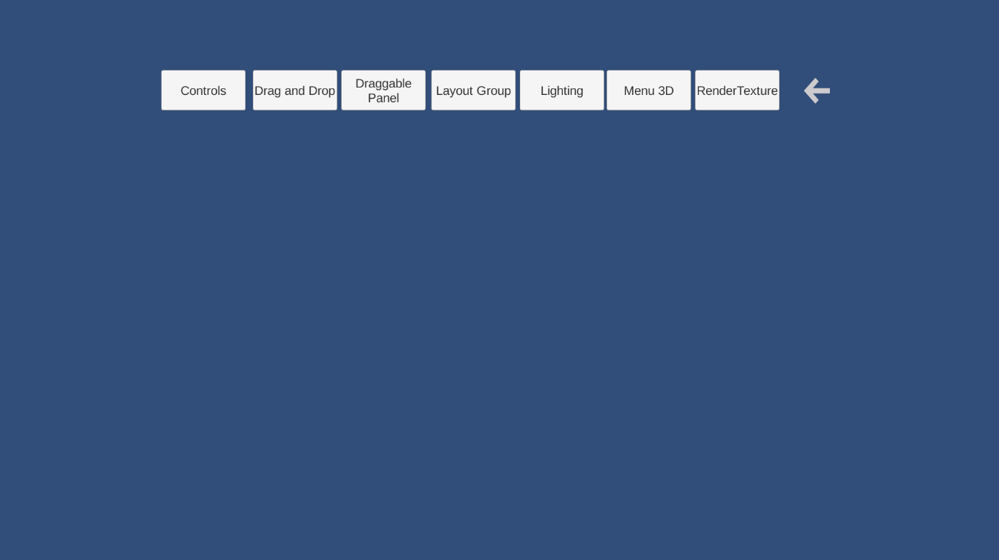
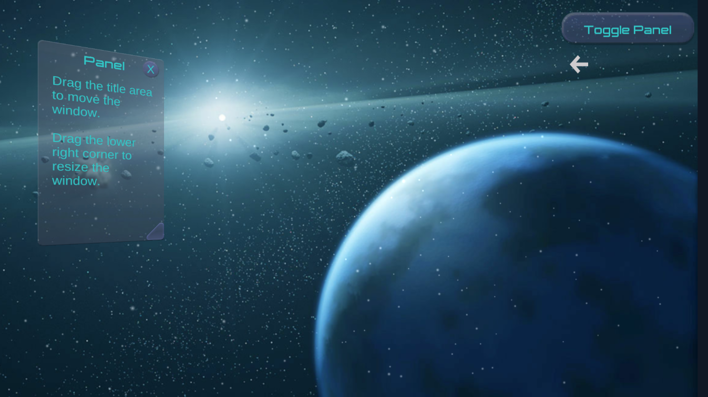
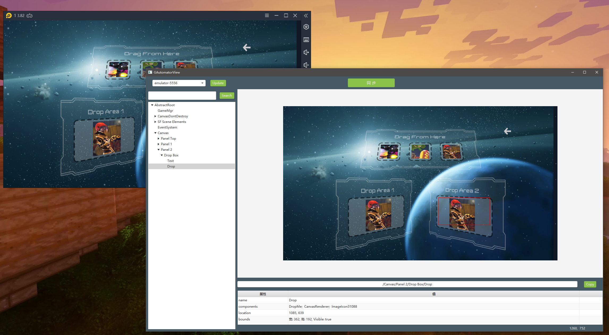

# UnityDemo-TestGAutomatorView
一个简易的Unity Demo，从Assets Store上下载了一个原始Demo，然后添加了场景跳转的功能。场景中有一些主要的UGUI控件，工程中已经嵌入了GAutomator的sdk，可以用来测试GAutomatorView工具。

## Build

构建安卓apk的话，记得配置好jdk和Android sdk，如果需要打包成il2cpp项目，还要配置ndk。然后在PlaySettings中配置好Package Name。之后Build就行了。

## Demo

工程中已经有一个构建好的 [Demo.apk](./Demo.apk) 可以用。

## 项目截图

